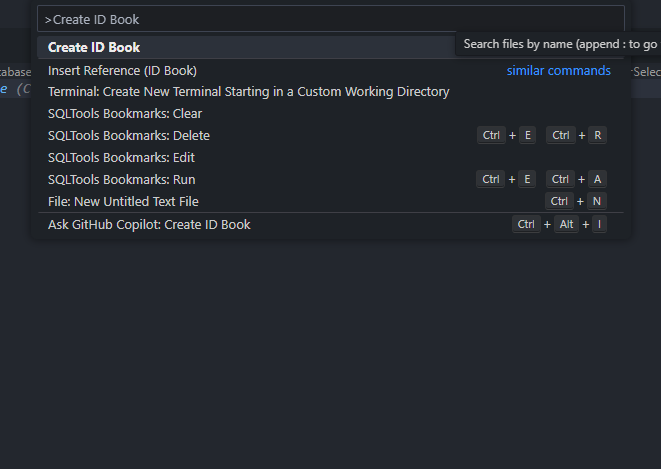
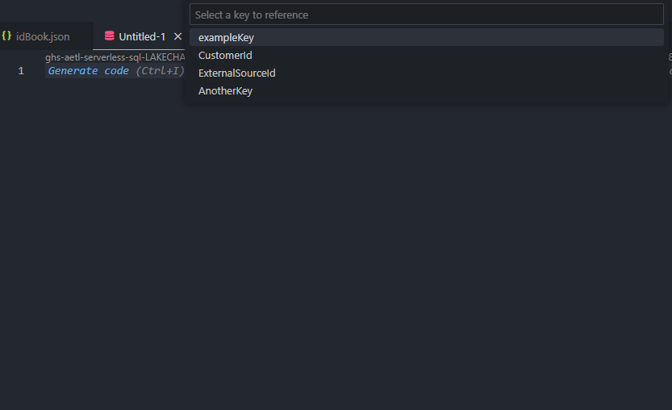

# idbook README

idBook is a VS Code extension built to function like a real life password book. It allows you to store long strings or guids in a json file to be referenced later. Rather than navigating to another application or tab to copy and paste, these strings can be handily inserted with a couple shortcuts. 

## Features

Describe specific features of your extension including screenshots of your extension in action. Image paths are relative to this README file.

For example if there is an image subfolder under your extension project workspace:

\!\[feature X\]\(images/feature-x.png\)

#### Creating your idBook

You can create and open your idBook.json with VS Code's Command pallete (Ctrl p)    '> Create ID Book'

This will create an idBook.json file in your project. Open it up and either replace the example key and example value, or add your own key value pairs below it. 

>Tip: When you create your ID Book this will also create, or append, to your gitignore. In most use cases you will not want to publish your GUIDs with your repo. Unless you plan to upload your GUID's, don't remove idBook.json from .gitignore.

#### Inserting idBook Values

When you want to insert one of your idBook values open command pallete again (Ctrl p) and use:  
'> Insert Reference (ID Book)'

Select your key from the drop down menu and the value will be inserted at your cursor's location.

## Known Issues

Feel free to open issues you encounter here: https://github.com/Tuckers15G/idbook/issues

### 1.0.0

Initial release of idBook!

